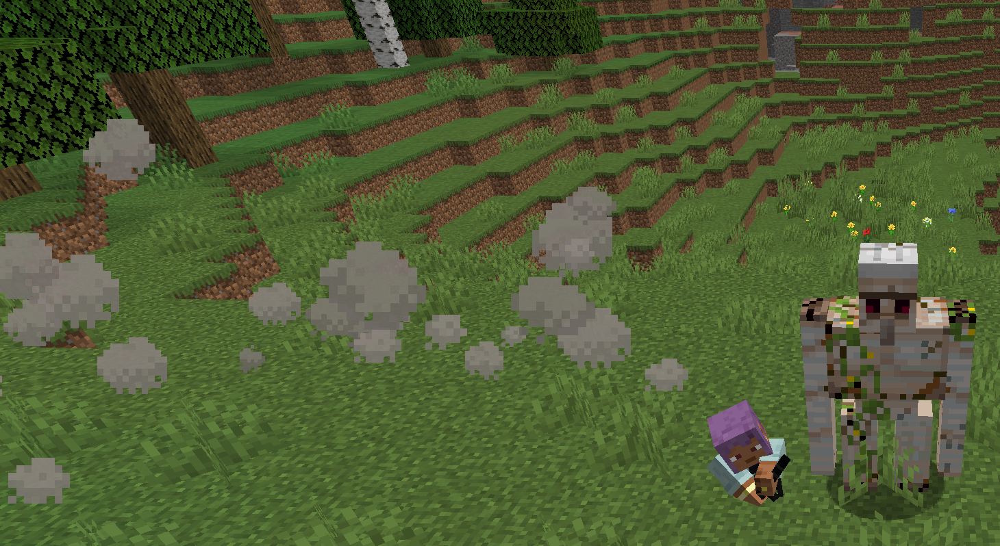

# Cigarrete Cross Slash

**Cigarrete Cross Slash** is a tactical and stylish ultimate Style that allows the user to mark a target from a distance before closing in for a cinematic finisher.

The user spits a "cigarette" projectile made of smoke. This projectile travels slowly, seeking out a nearby target. Once the projectile makes contact with an enemy or a surface, the user instantly teleports to the point of impact and delivers a powerful, cross-shaped slash.

## Mechanics
- **Projectile:** Upon activation, a slow-moving smoke projectile is launched from the player. This projectile will lightly track a nearby enemy.
- **Impact & Teleport:** When the projectile hits an entity or a block, the user instantly teleports behind the target or to the impact point.
- **Cinematic Attack:** A cinematic camera takes control to showcase the attack. The player performs a unique animation, delivering two slashes that form a glowing 'X' on the target.
- **Damage:** The target hit by the initial projectile takes massive damage from the follow-up slash.

## Requirements
- **Style Gauge:** Must be at S-Rank.
- **Weapon:** Must be holding a sword.
- **Stance:** The sword must be in its sheathed state.
- **Status Effect:** The player must be under the `SMOKING` effect to activate this style.

## Keybind
- **Default:** `Tab`