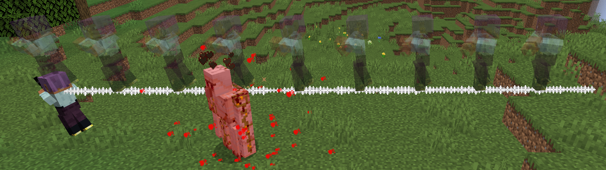

# Iai: White Purity

**Iai: White Purity** is a high-speed, long-range ultimate Style that embodies the "one-hit kill" philosophy of the iaijutsu swordsman.

Upon activation, the user takes a focused stance. After a brief delay, they perform an instantaneous dash forward, slicing through every enemy in their path with a single, clean draw of their blade. The attack is so fast that the user appears at their destination at the same moment the slash occurs.

## Mechanics
- **Activation:** The player character plays a unique "ready" animation, and a cinematic camera takes control to show a side-view of the impending attack path.
- **Execution:** After a 1-second delay, the player teleports up to 15 blocks forward (or until they hit a solid obstacle).
- **Damage:** A trail of white slash particles appears along the entire path of the dash. All hostile entities caught within this path take massive damage simultaneously.
- **Aftermath:** Control is returned to the player after the cinematic camera lingers for a moment to show the result of the devastating attack.

## Requirements
- **Style Gauge:** Must be at S-Rank.
- **Weapon:** Must be holding a sword.
- **Stance:** The sword must be in its sheathed state.

## Keybind
- **Default:** `Tab`