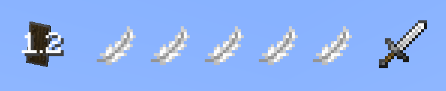
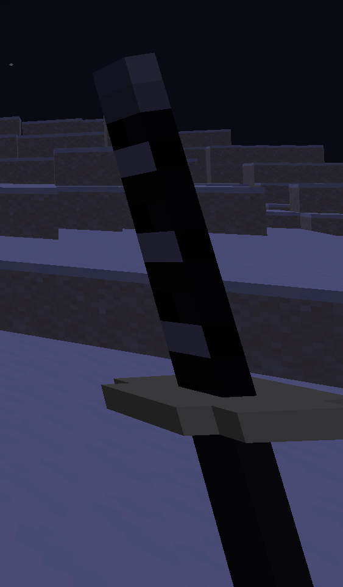

# Combat Mode

Combat Mode is the heart of Kagurabachi Craft's gameplay. It is a toggleable stance that completely replaces vanilla Minecraft's combat with a faster, more technical system.

To enter Combat Mode, press the designated key (default: `Y`). Your HUD will change, and your abilities will be drastically different.

## The Combat HUD

When in Combat Mode, a new UI element will appear on your screen, showing your available resources.

- **Dodge Charges:** The square-shaped icons indicate how many times you can dodge.
- **Parry/Heavy Cooldown:** The icons show the cooldown status of your Parry and Heavy Attack abilities.

## Core Actions

### Basic Attacks
- **Light Attack (LMB):** Perform a quick combo of attacks. These differ depending on whether you are holding a sword or fighting with your bare hands.

### Heavy Attacks
- **Heavy Attack (RMB):** A powerful move with several variations depending on your actions and equipment.
    - **Standard Heavy Attack:** Charge up and release a slower attack that can break an opponent's guard.
    - **Dash Attack (Sprint + RMB with Sword):** When performed with a sword while sprinting, you will lunge forward in a devastating dash, cutting through everything in your path.
    - **Slam Attack (Jump + RMB):** Holding the heavy attack key while jumping will launch you high into the air. Releasing it will cause you to slam down from the sky, creating a powerful area-of-effect impact.
    - **Unarmed Heavy Attack Variations:** Unarmed heavy attacks offer unique utility:
        - **Directional Knockback:** When releasing an unarmed heavy attack, you can influence the direction your opponent is knocked back. By looking to the left or right of your target, you can send them flying sideways.
        - **Ground Slam:** If you look directly at the ground while releasing an unarmed heavy attack, you will slam the ground, creating a shockwave that launches all nearby enemies into the air.

### Defensive Maneuvers
- **Dodge (LALT by default):** Quickly dash in a chosen direction to evade attacks. This consumes a Dodge Charge. Charges regenerate over time.
- **Block (Hold Shift):** Reduces incoming damage.
- **Parry (Tap Shift right before an attack hits):** Perfectly time a block to deflect an enemy's attack, leaving them stunned and vulnerable for a counter-attack.

### Sheathing & Riposte
You can toggle your katana between a drawn and sheathed state with a dedicated key (default: `H`).

While this may seem cosmetic, it has a crucial combat function. **Parrying an attack while your katana is sheathed will perform an instant, damaging counter-attack.** This is a high-risk, high-reward maneuver that deals significant damage based on your Sword Mastery and the weapon's own power.

## PvP: Attack Clashes

When two or more players in Combat Mode strike each other with light attacks at nearly the same moment, their attacks will clash instead of dealing damage. This mechanic turns head-on engagements into a tense battle of timing.

When a clash occurs, both players are knocked back slightly, and a special effect plays out depending on the weapons used:
- **Sword vs. Sword:** A sharp metallic sound plays, and sparks fly from the impact.
- **Fist vs. Fist:** A concussive boom echoes as the blows meet, creating a sonic shockwave.
- **Sword vs. Fist:** A powerful block effect occurs, signifying the clash between steel and raw power.

## Spiritual Energy (SE) Mastery & Buffs

Spiritual Energy (SE) is your core life force and the fuel for many powerful abilities. Your **SE Mastery** level is the most fundamental stat you have. Leveling it up not only increases your maximum pool of Spiritual Energy but also grants significant passive buffs to your character.

These buffs are always active as long as the game rule `kbc_buffs_from_se_mastery` is enabled.

| SE Mastery Level | Buffs Gained |
| :---: | :--- |
| **1** | Health Boost I (+2 Hearts) |
| **2** | Health Boost III (+6 Hearts) |
| **3** | Speed I |
| **4** | Health Boost V (+10 Hearts) |
| **5** | Speed II |
| **6** | Health Boost IX (+18 Hearts) |
| **7** | Resistance I |
| **8** | Health Boost XIII (+26 Hearts), Speed III |
| **9** | Resistance II |
| **10**| Health Boost XVII (+34 Hearts) |