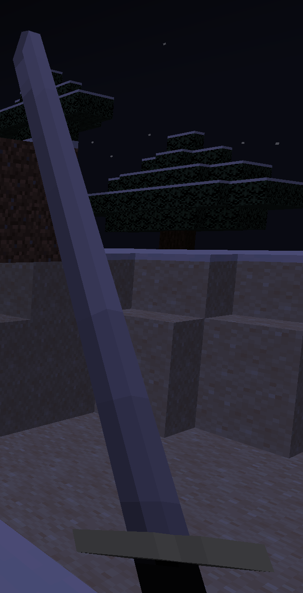
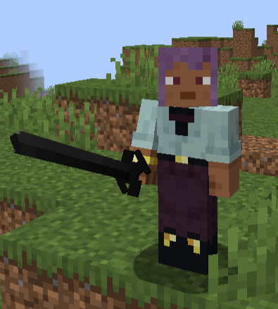

# The Enchanted Blades

The Enchanted Blades are six legendary katanas forged during a great war, each imbued with immense, world-altering power. It is said a secret seventh blade was also forged in the aftermath. These legendary weapons are the key to unlocking their namesake Sorcery.

These blades are the ultimate goal for any warrior or sorcerer. Wielding one is not a simple matter of picking it up; it requires you to form a binding contract with the blade itself, granting you access to its unique and devastating **Sorcery**.

### General Mechanics
*   **Indestructible & Powerful:** The blades are indestructible and possess high base damage.
*   **Sheathing:** The blades can be sheathed. Most magical abilities require the blade to be unsheathed.

## The Blade Contract

When you acquire an Enchanted Blade, you don't just wield it; you form a contract with it. This is a powerful bond that links the blade's power directly to you.

### Forming a Contract
The first time you hold an unowned Enchanted Blade in your main hand, a contract is automatically forged.
- The blade becomes attuned to you, storing your unique signature.
- Your active Sorcery Type is automatically switched to the one corresponding to the blade (e.g., holding Enten grants you Enten Sorcery).
- A message will appear, confirming the contract, and you will hear a powerful sound as the bond settles.

### Breaking a Contract
This powerful bond is also fragile. By default, if you die while under contract with a blade, the contract is severed.
- The blade loses its owner and becomes unowned again, ready for a new user to form a contract.
- You lose access to its Sorcery and will revert to your previous Sorcery Type (or none).
- A message will notify you that your contract has been broken.

However, this behavior can be changed. Server administrators or players in single-player worlds can use the game rule `/gamerule kbc_keep_enchanted_blades_contract_after_death true` to disable this feature, allowing you to keep your contract even after death.

---

## Enten 
    

####- **Sorcery:** Forming a contract with Enten is the key to unlocking the **[Enten Sorcery](Sorcery Types\enten.md)**. 
---

## Tobimune

####- **Sorcery:** Forming a contract with Tobimune is the only way to unlock the **[Tobimune Sorcery](Sorcery Types\tobimune.md)**.
