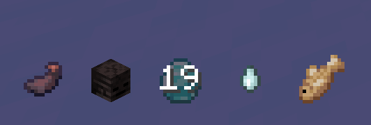

# Sorcery

Sorcery is the art of channeling Spiritual Energy to manifest powerful, supernatural techniques. Once a player has unlocked a **Sorcery Type**, they gain access to a new set of abilities and a dedicated user interface.

## The Sorcery HUD

When you are in Combat Mode and have a Sorcery equipped, a new HUD element appears to the left of your hotbar, displaying your 6 available ability slots.

- **Icons:** Each icon represents a different ability.
- **Cooldown:** A grey overlay and a countdown timer will show when an ability is on cooldown.
- **Resource Cost:** If you lack the resources (SE, Kuro Fish, etc.) to use an ability, its icon will blink red.
- **Charge Meter:** Some abilities can be charged by holding the key. A vertical bar will appear over the icon to show the charge level.

## Using Abilities

To use your Sorcery abilities, you must first switch from your standard combat moveset to your Sorcery moveset.

- **Toggle Sorcery Mode (Default: `G`):** Pressing this key will switch your keybinds. Your character will often take a different stance.
- **Primary Ability (LMB):** Use your main offensive spell.
- **Secondary Ability (RMB):** Use your secondary spell. Often, this can be held down to charge the ability for a more powerful effect.
- **Utility Ability (Shift):** Use your utility or movement spell.

Other abilities are bound to different keys as specified in their descriptions.

## Available Sorcery Types

Your Sorcery is determined by the Enchanted Blade you align with, or by a rare, innate talent.

- ### [Enten Sorcery](sorcery/enten.md)
  The dark art of the seventh Enchanted Blade, focusing on summoning and commanding ink-like creatures.

- ### [Isou Sorcery](sorcery/isou.md)
  *A powerful, earth-shattering sorcery. (Details coming soon).*