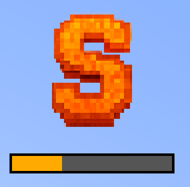
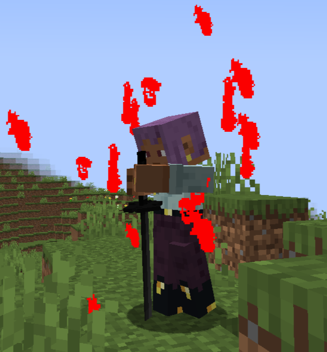
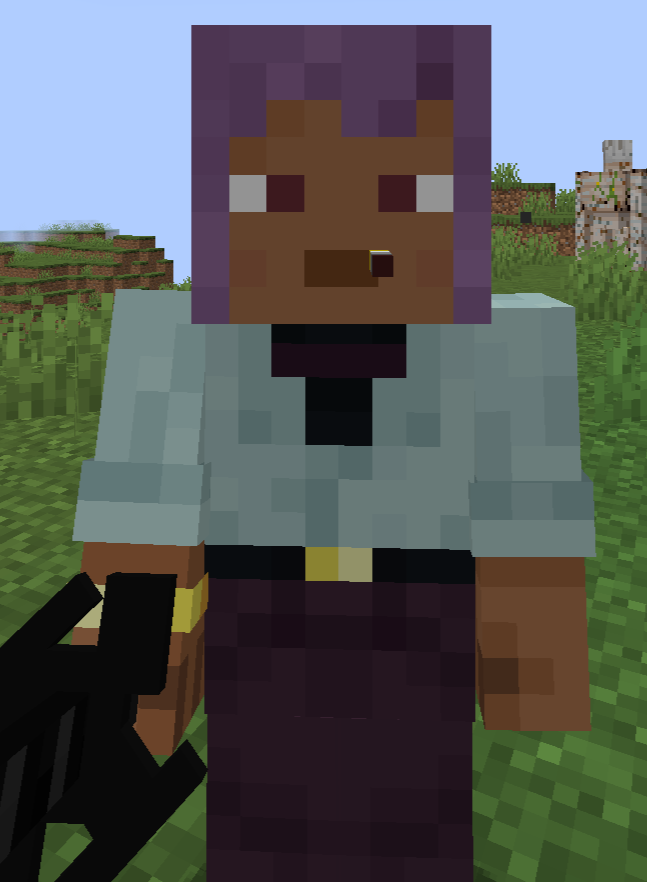

# Style System

Styles are ultimate abilities that can only be used by filling the "Style Gauge" to S-Rank. A player can select one of their unlocked styles from the character stats menu.

## Gaining Style Points

A player accumulates "Style Points" by performing varied and effective actions in combat (only while in "Combat Mode"). The gauge has several ranks: C (0+), B (200+), A (500+), and S (1000+). Points are awarded for:

*   Dealing damage.
*   Executing long combos.
*   Using a variety of different attacks.
*   Attacking while airborne (bonus points).
*   Performing perfect parries (large bonus).
*   Finishing off enemies.
*   Using Sorcery.
*   Landing backstabs.

Style points gradually decrease when out of combat. Upon reaching S-Rank, the player can press the Style key (`Tab` by default) to activate a powerful attack that consumes all accumulated points.

## Aura Farming

This is a high-risk, high-reward mechanic. By pressing a dedicated key (`N` by default), the player enters a meditative stance. They cannot move or attack, and all incoming damage is doubled. However, after a few seconds, they will begin to passively gain a large number of Style Points. Any action or incoming damage will interrupt the process. This is a way to rapidly build style outside of a fight, but at the cost of extreme vulnerability.

## Special Style Requirements

Some styles may have unique prerequisites before they can be activated.

- **Smoking:** Certain styles require the user to be under the `SMOKING` status effect.

## Available Styles

- ### [Iai: White Purity](Styles/iai_white_purity.md)
  A lightning-fast draw that strikes all enemies in a long line.

- ### [Cigarrete Cross Slash](Styles/cigarrete_cross_slash.md)
  Spit a seeking projectile to mark a target, then teleport to them for a devastating cross-slash.